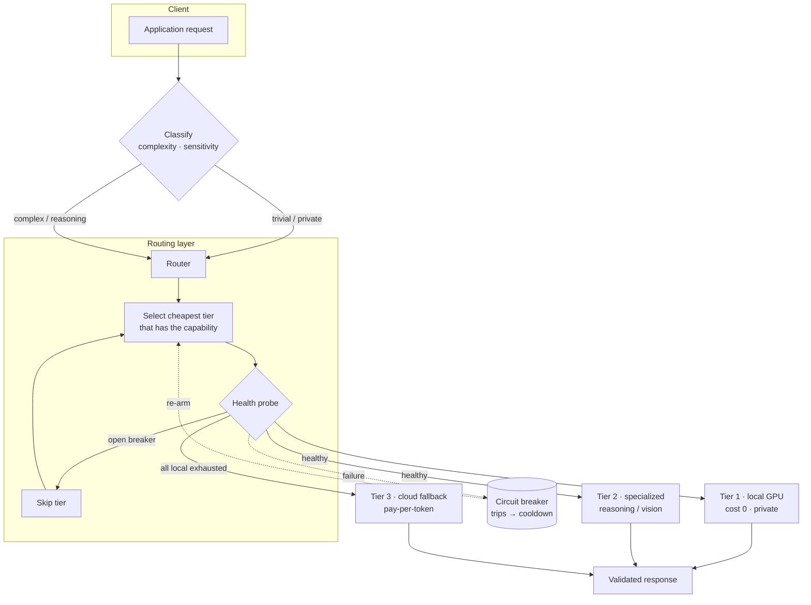
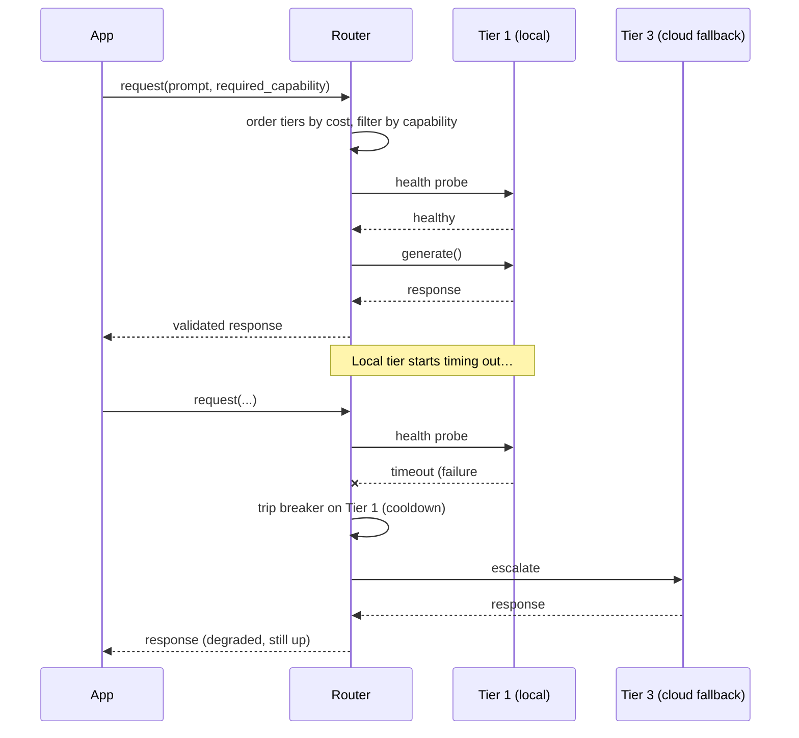

<!-- Copyright © 2026 SurgeXi Business Intelligence, a Teamsmith Enterprises LLC company. All Rights Reserved. -->
# Architecture & Case Study — Tiered LLM Inference Router

> A reference write-up of a routing layer I designed and run in production AI
> platforms. The patterns here are generic; no proprietary code, prompts,
> endpoints, or model names are included.

## 1. Context & problem

Most LLM applications bind to a single model behind a single provider. That
creates three failure modes at once:

- **Availability** — one provider outage or rate-limit window takes the whole
  product down. There is no second path.
- **Cost** — every request, however trivial, hits the most capable (and most
  expensive) model. A "what's 2+2"-class prompt pays frontier-model prices.
- **Privacy & latency** — sensitive or latency-critical traffic is shipped to a
  remote API when a local model could have served it faster and on-prem.

The job of the router is to turn *"a model"* into *"a resilient pool of models"*
— and to make the routing decision on **capability and cost**, not on a
hard-coded provider.

## 2. System architecture

### Request lifecycle (happy path + degradation)

## 3. Key design decisions

| # | Decision | Why |
|---|----------|-----|
| 1 | **Cost-then-capability ordering** | Tiers are sorted cheapest-first; a request is served by the *first* tier that both is healthy and advertises the required capability. Trivial traffic never reaches the expensive tier. |
| 2 | **Active health probes, not passive retries** | A tier that times out is *removed from the pool*, not retried into the ground. This stops one sick backend from amplifying latency across every request. |
| 3 | **Circuit breaker with half-open recovery** | After N failures a tier's breaker opens for a cooldown; it then half-opens to test recovery before rejoining. Prevents flapping backends from thrashing the pool. |
| 4 | **Capability tags as the contract** | Tiers declare `[chat, vision, reasoning, …]`. Routing is a set-membership check, so adding a model is a config change, not a code change. |
| 5 | **One uniform backend interface** | Local (OpenAI-compatible), self-hosted, and cloud APIs sit behind a single `generate()` surface, so the routing logic is provider-agnostic. |

Full decision records: [`docs/adr/`](docs/adr/).

## 4. Trade-offs

- **Classification cost vs. routing benefit** — every request pays a small
  classification step. Kept cheap (heuristic by default; pluggable to a learned
  classifier) so it never dominates the request budget.
- **Freshness of health state** — probing on the request path adds latency;
  caching health risks routing into a just-failed tier. The breaker is the
  compromise: cheap steady-state, fast reaction on failure.
- **Cheapest-capable ≠ best-quality** — cost-first ordering can serve a "good
  enough" answer from a smaller model. Where quality is non-negotiable, a
  capability tag (`reasoning`) forces escalation regardless of cost.

## 5. Outcomes (architectural properties achieved)

- **No single-provider outage is fatal** — provider failure degrades to a
  fallback path instead of taking the product down.
- **Expensive-tier traffic drops sharply** — trivial requests are absorbed by
  the free local tier, so the paid tier sees only what genuinely needs it.
- **Sensitive traffic can stay on-prem** — the classifier can pin private
  requests to local tiers and never let them leave the network.
- **Adding/retiring a model is a config edit** — no redeploy to change the pool.

## 6. Where this came from

Distilled from multi-tier inference platforms I've built and operated on real
on-prem GPU hardware plus cloud fallback. The implementation specifics stay
private; the *pattern* is what's worth sharing — and it's a pattern, not a
secret.
