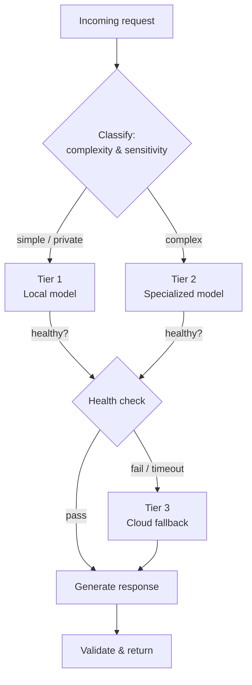

# 🧭 llm-inference-router

> A health-aware, cost-optimized **tiered LLM routing pattern** — route each request to the cheapest capable model, fall back gracefully when a tier is unavailable, and never let a single provider outage take the system down.

[](https://github.com/tsmith-surgexi/llm-inference-router/actions/workflows/ci.yml)
[](LICENSE)
[](requirements.txt)

This is a **reference implementation** of a production pattern I use in real platforms. It is intentionally generic: it ships with placeholder tiers so you can wire in your own models. No proprietary model weights, prompts, or routing policy are included.

---

## Why this exists

Most LLM apps hard-wire a single model. That's fragile and expensive:
- One provider outage = total downtime.
- Every request hits your most powerful (most expensive) model, even trivial ones.
- No graceful degradation when a model is rate-limited.

A **routing layer** solves all three. It treats your models as a prioritized pool: cheap-and-local first, escalate only when needed, fall back to cloud when local capacity is exhausted.

## Architecture



## Features

- **Priority-based routing** — ordered tiers with per-tier capability tags
- **Active health checks** — unhealthy tiers are skipped, not retried into the ground
- **Cost-aware escalation** — only promote to a pricier tier when the cheaper one can't serve the request
- **Circuit breaker** — auto-disable a flapping tier for a cooldown window
- **Pluggable backends** — local (OpenAI-compatible), self-hosted, or cloud APIs behind one interface
- **Structured telemetry** — per-tier latency, cost, and fallback-rate metrics

## Quick start

```bash
git clone https://github.com/tsmith-surgexi/llm-inference-router.git
cd llm-inference-router
cp config.example.yaml config.yaml   # add your own tiers + endpoints
pip install -r requirements.txt
python -m router.serve
```

## Configuration (example)

```yaml
# config.example.yaml — replace with your own endpoints
tiers:
  - name: local-primary
    endpoint: http://localhost:8000/v1
    cost_per_1k: 0.0
    capabilities: [chat, vision]
    timeout_s: 30

  - name: specialized
    endpoint: ${SPECIALIZED_ENDPOINT}
    cost_per_1k: 0.0
    capabilities: [chat, reasoning]
    timeout_s: 45

  - name: cloud-fallback
    endpoint: https://api.your-cloud-provider.com/v1
    api_key: ${CLOUD_API_KEY}
    cost_per_1k: 3.0
    capabilities: [chat, vision, reasoning]
    timeout_s: 60

routing:
  strategy: cost_then_capability
  circuit_breaker:
    failure_threshold: 3
    cooldown_s: 120
```

## Design notes

The router never assumes a tier is up. Each request path runs a fast health probe; a tier that times out or errors past the threshold trips its circuit breaker and is removed from the pool until cooldown expires. This is what turns "three models" into "one resilient system."

## Roadmap

- [ ] Semantic request classification for smarter tier selection
- [ ] Per-tenant routing policies
- [ ] Prometheus exporter for the telemetry stream

## Architecture & case study

For the full write-up — problem framing, architecture diagrams, sequence
flows, design-decision records (ADRs), and trade-offs — see
**[ARCHITECTURE.md](ARCHITECTURE.md)** and the [ADRs](docs/adr/).

## License

MIT — see [LICENSE](LICENSE).

---

*Part of my AI‑platform work — see my other [pinned repositories](https://github.com/tsmith-surgexi) and the platform they support at [SurgeXi](https://surgexi.com).*
